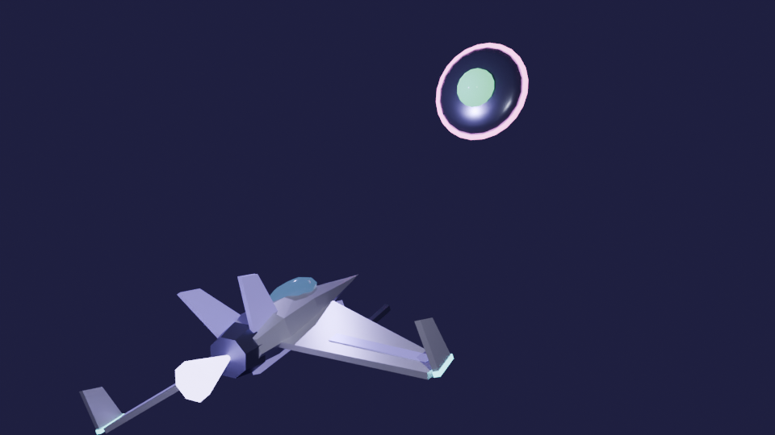

# Invasão Hiragana 3D

Releitura em 3D do jogo [Invasão Hiragana](https://senseidiegohorta.my.canva.site/invas-o-hiragana): um shooter de trilho
no estilo dos clássicos de nave espacial, em que você pilota a **KANA-01**, dispara o **hiragana correto** em cada
invasor e salva o universo do esquecimento.



## Jogar

Abra **`invasao-hiragana-3d.html`** em qualquer navegador moderno. O arquivo é autocontido (JavaScript, CSS e
modelos 3D embutidos), funciona offline e pode ser hospedado em qualquer lugar ou aberto direto do disco.

## Como funciona

| Elemento              | Descrição                                                                                                                                                                                     |
| --------------------- | --------------------------------------------------------------------------------------------------------------------------------------------------------------------------------------------- |
| Mecânica original     | Cada invasor carrega um hiragana; só a munição com o **mesmo caractere** o destrói.                                                                                                           |
| Dinâmica de nave      | Voo em trilho com câmera em terceira pessoa, inclinação nas curvas, mira dupla à frente, **rolagem** que reflete disparos, asteroides e **portais dourados** que recarregam escudo e memória. |
| Sequência de palavras | A missão mostra uma palavra real (ex.: ねこ = gato). Destrua os invasores com halo dourado **na ordem**.                                                                                      |
| Comemoração           | Ao completar a palavra: câmera lenta, onda de choque que limpa a tela, fogos, confete de hiragana, flash, tremor e uma "poluição sonora" de explosão, fanfarra, buzinas, apitos e torcida.    |
| Trilha sonora         | Lo-fi sci-fi calmo gerado em tempo real (piano elétrico FM, pad, baixo, bateria com swing, chiado de vinil, oscilação de fita e "bips" de sonda).                                             |
| Progressão            | 5 setores: あ行 → か行 → さ行 → た行 → な行, 3 palavras por setor. Depois, modo infinito com todos os caracteres.                                                                             |

## Acessibilidade e robustez

- Teclado, mouse, **toque** (joystick virtual) e **gamepad**.
- Troca de munição digitando o **romaji** (`k` + `a` = か), pelas teclas `1`–`0`, `Tab`, roda do mouse ou tocando na barra.
- Dificuldades **Cadete / Piloto / Ás**; mira assistida e tiro automático opcionais.
- Romaji nos invasores, **alto contraste**, **reduzir flashes** (respeita `prefers-reduced-motion`), flashes limitados a 2 por segundo.
- Pronúncia japonesa pela voz do sistema, anúncios para leitores de tela (`aria-live`), foco visível e diálogos nativos.
- Qualidade gráfica automática (desliga o bloom em aparelhos lentos), pausa ao trocar de aba, limitador de áudio.
- Configurações e recorde salvos no navegador.

## Estrutura

```
blender/modelos.py   Script do Blender que modela nave, invasor, asteroide e portal e exporta o GLB
assets/              invasao-hiragana.glb (gerado) e preview-blender.png (render Cycles)
src/                 Código do jogo (Three.js) — game.js, audio.js, kana.js, main.js, index.html, styles.css
build.mjs            Empacota tudo em invasao-hiragana-3d.html
```

## Recriar a partir do código-fonte

```bash
# 1. Modelos 3D (Blender 4.2+ ou o módulo Python do Blender: pip install bpy)
blender --background --python blender/modelos.py -- --render
# ou: python3 blender/modelos.py --render

# 2. Jogo
npm install
npm run build      # gera invasao-hiragana-3d.html
npm run dev        # recompila a cada alteração
```
