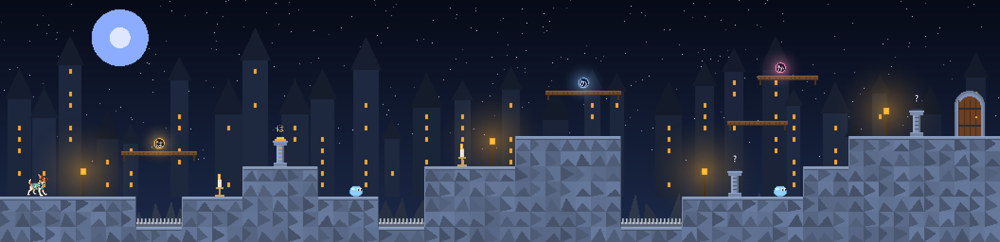
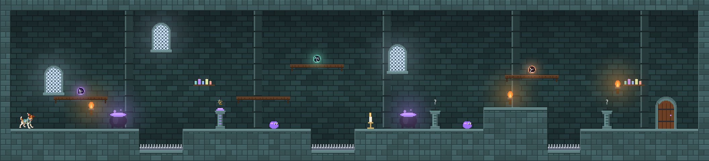
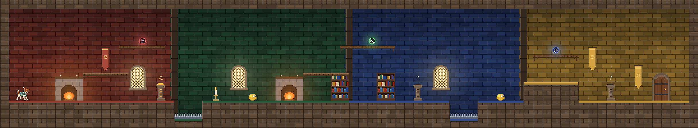
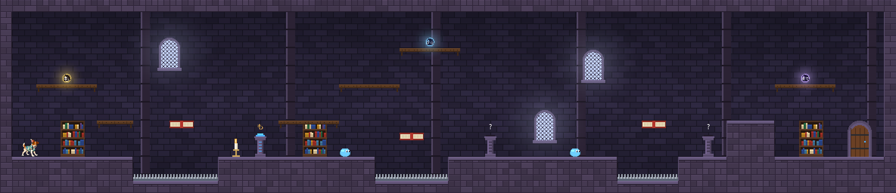

# Pongo e as Partículas Mágicas

Jogo de plataforma 2D para a Unity. O Pongo atravessa o castelo mágico procurando as **partículas do japonês**, que fugiram do Grimório e viraram artefatos flutuantes. Em cada andar ele precisa:

1. **Encontrar** as 3 partículas escondidas (は, を, に…);
2. **Combinar** cada uma com a sua função num **Altar da Função**. O altar mostra a função pedida (TÓPICO, OBJETO DIRETO…) e uma frase com lacuna;
3. **Abrir a porta** quando os 3 altares estiverem acesos.

Escolher a partícula errada custa um coração. Em troca, o jogo explica o que aquela partícula faz de verdade. A função só aparece completa no **Grimório** (tecla Tab) depois que o jogador acerta no altar.



## Como abrir

1. No Unity Hub, crie um projeto novo com o modelo **2D** (Built-In) ou **Universal 2D**. Funciona da Unity 2021.3 LTS até a Unity 6.
2. Copie a pasta `Assets/PongoParticulas` deste repositório para a pasta `Assets` do projeto.
3. Abra qualquer cena (a `SampleScene` vazia serve) e aperte **Play**.

Não é preciso montar cena, prefab nem Canvas: o script `GameBoot` cria tudo por código ao apertar Play. A interface usa IMGUI e o teclado é lido pelos eventos do IMGUI. Por isso o jogo funciona com o Input Manager antigo, com o novo Input System ou com os dois.

> Se o projeto tiver outras cenas e você não quiser que o jogo inicie nelas, mude `GameBoot.AutoStart` para `false` e coloque um objeto com `GameManager` só na cena do jogo.

## Controles

| Ação | Teclas |
|---|---|
| Andar | ← → ou A D |
| Pular (segure para pular mais alto) | Espaço, ↑, W ou Z |
| Usar altar | E (ou ↓ / S) |
| Escolher partícula no altar | 1–9 ou clique |
| Grimório | Tab |
| Confirmar / sair do painel | Enter / Esc |

Pule em cima das gotas de poção para derrotá-las. As velas são checkpoints: depois de cair nos espinhos, o Pongo volta para a última vela acesa.

## Os 4 andares e as 12 partículas (nível N5)

| Andar | Cenário (referência) | Partícula | Função | Frase do altar |
|---|---|---|---|---|
| 1 · Pátio das Rochas | castelo impresso em 3D sobre rochas facetadas | **は** (wa) | Tópico | わたし **は** ポンゴです。 Eu sou o Pongo. |
| | | **の** (no) | Posse / ligação | ポンゴ **の** シャツ · a camisa do Pongo |
| | | **か** (ka) | Pergunta | これは しろです **か**。 Isto é um castelo? |
| 2 · Masmorra das Poções | laboratório de poções isométrico | **を** (o) | Objeto direto | ポーション **を** のみます。 Bebo a poção. |
| | | **で** (de) | Lugar da ação / meio | なべ **で** ポーションを つくります。 Faço a poção no caldeirão. |
| | | **と** (to) | E / com | ねこ **と** いぬ · o gato e o cachorro |
| 3 · Salas Comunais | as quatro salas (vermelha, verde, azul, amarela) | **に** (ni) | Existência / hora / destino | へや **に** ねこが います。 Há um gato na sala. |
| | | **へ** (e) | Direção | としょかん **へ** いきます。 Vou para a biblioteca. |
| | | **が** (ga) | Sujeito | ほし **が** きれいです。 As estrelas são bonitas. |
| 4 · Torre da Biblioteca | biblioteca noturna com livros voadores | **も** (mo) | Também | わたし **も** いぬです。 Eu também sou um cachorro. |
| | | **から** (kara) | Ponto de partida | くじ **から** よみます。 Leio a partir das nove. |
| | | **まで** (made) | Limite | ごじ **まで** よみます。 Leio até as cinco. |

A bolsa de partículas acumula de um andar para o outro. Assim, cada altar tem mais opções erradas para descartar, e o jogador revisa o que já aprendeu.

| Andar 2 | Andar 3 | Andar 4 |
|---|---|---|
|  |  |  |

## Organização do código

```
Assets/PongoParticulas/
  Resources/pongo.png              ilustração do Pongo (fundo transparente)
  Resources/Fonts/NotoSansJP.ttf   fonte com kana (subconjunto da Noto Sans CJK JP, licença OFL)
  Scripts/
    Core/    GameBoot (início automático), GameManager (regras), GameInput, JpFont, Compat
    Data/    GameData: partículas, frases dos altares e mapas das fases
    Art/     PixelCanvas + Art: toda a pixel art desenhada por código; Theme: paletas
    World/   LevelBuilder: transforma o mapa de texto em fase
    Actors/  Pongo, partículas, altares, porta, velas, espinhos, gotas, livros voadores, câmera
    UI/      GameUI: HUD, altar, grimório e telas
    Audio/   Sfx: efeitos sonoros sintetizados
```

### Editar ou criar fases

Cada fase é um mapa de texto em `GameData.cs`. A linha 0 é o topo:

```
#  bloco            -  plataforma (atravessa por baixo)    ^  espinhos
P  início do Pongo  1 2 3  partículas                      a b c  altares
D  porta (2x3)      E  gota de poção    C  vela (checkpoint)    m  livro voador
W janela  B estante  K caldeirão  F lareira  N estandarte  T tocha  L lanterna  H prateleira
```

O pulo do Pongo alcança **3 blocos de altura** e cerca de **5 blocos de distância**. Os quatro mapas foram conferidos com uma simulação dessa física: todas as partículas, altares e portas são alcançáveis.

### Trocar a arte

Os sprites são gerados em `Art.cs`. Para usar arte própria (renders do Blender ou sprite sheets do Pongo), troque o método correspondente por `Resources.Load<Sprite>(...)`. O Pongo usa uma ilustração única, animada com estica-e-encolhe, balanço ao correr e inclinação no pulo. Uma sprite sheet com quadros de corrida e pulo pode substituí-la em `PongoController`.

### Fonte japonesa

A fonte incluída tem só os caracteres usados no jogo: todos os hiragana e katakana, latim com acentos e símbolos. Se você acrescentar frases com **kanji**, troque `Resources/Fonts/NotoSansJP.ttf` pela fonte completa. Sem esse arquivo, o jogo usa as fontes japonesas do sistema, que não existem em builds WebGL.

## O que foi verificado

- Todos os scripts compilam contra as bibliotecas de referência da Unity 2021.3. O caminho da Unity 6 (`linearVelocity`, `bodyType`) fica atrás de `#if UNITY_6000_0_OR_NEWER`.
- O código de pintura (`Art.cs`) foi executado fora da Unity para gerar as imagens acima.
- Os mapas foram testados com uma simulação da física do pulo.
- **Ainda não foi testado dentro do editor da Unity.** Ao abrir pela primeira vez, vale conferir o tamanho do texto sobre as partículas e a sensação do pulo. As constantes ficam no topo de `PongoController`.
